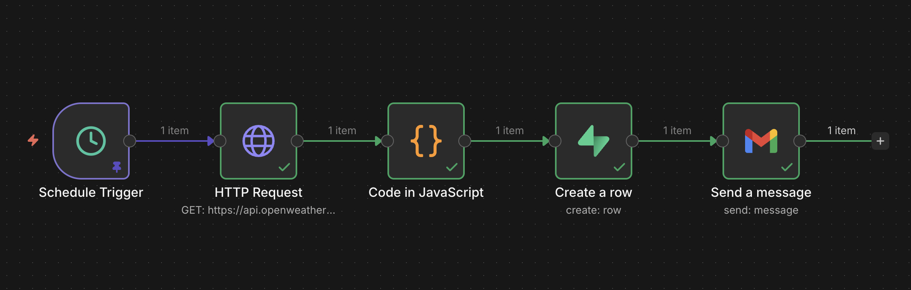

# Daily Weather Automation (n8n)

## Overview
This repository contains an n8n workflow that automates daily weather reporting. The workflow fetches real-time data for a specific city, which is San Diego, CA in this case, evaluates weather conditions against custom alert logic (Heat, Frost, Precipitation), logs the historical data to a Supabase database, and sends a formatted email summary.



## Features
* **Cron Trigger:** Runs automatically every day at 8:00 AM.
* **Data Fetching:** Retrieves rich weather data from OpenWeatherMap API.
* **Custom Logic:** Javascript (Code Node) to normalize units and determine alerts.
    * *Precipitation:* Rain, Snow, Drizzle, Storm, Thunder.
    * *Heat Alert:* > 32°C.
    * *Frost Alert:* < 0°C.
* **Database Logging:** Archives weather stats into Supabase (PostgreSQL).
* **Notifications:** Sends a clean, formatted daily email with dynamic subject lines.

## Configuration & Setup

### 1. Prerequisites
* **n8n:** A self-hosted or cloud instance of n8n.
* **OpenWeatherMap:** A free API key.
* **Supabase:** A project with a database.

### 2. Database Schema (Supabase)
Run the following SQL query in your Supabase SQL Editor to create the required table.

```sql
CREATE TABLE weather_logs (
  id UUID DEFAULT gen_random_uuid() PRIMARY KEY,
  run_at TIMESTAMP WITH TIME ZONE DEFAULT NOW(),
  city TEXT,
  temperature FLOAT,
  temperature_unit TEXT,
  condition TEXT,
  humidity INT,
  wind_speed FLOAT,
  alert_type TEXT,
  summary TEXT,
  raw_response JSONB
);
```

### 3. Workflow Setup
1.  **Import:** Download `daily-weather-automation.json` from this repository and import it into n8n (**Menu** > **Import from File**).
2.  **Credentials:**
    * **HTTP Request Node:** Add your OpenWeatherMap API Key in the `appid` query parameter.
    * **Supabase Node:** Create a new credential using your Project URL and `service_role` Key.
    * **Email Node:** Authenticate with your Gmail or SMTP credentials.
3.  **Activate:** Toggle the workflow to **Active**, the switch on the top right.

## Deliverables Included
* `daily-weather-automation.json`: The importable workflow file.
* `workflow-screenshot.png`: Visual overview of the node structure.
